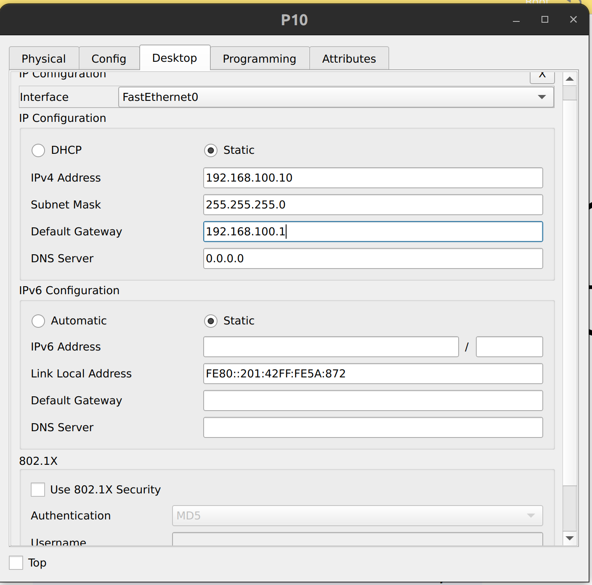
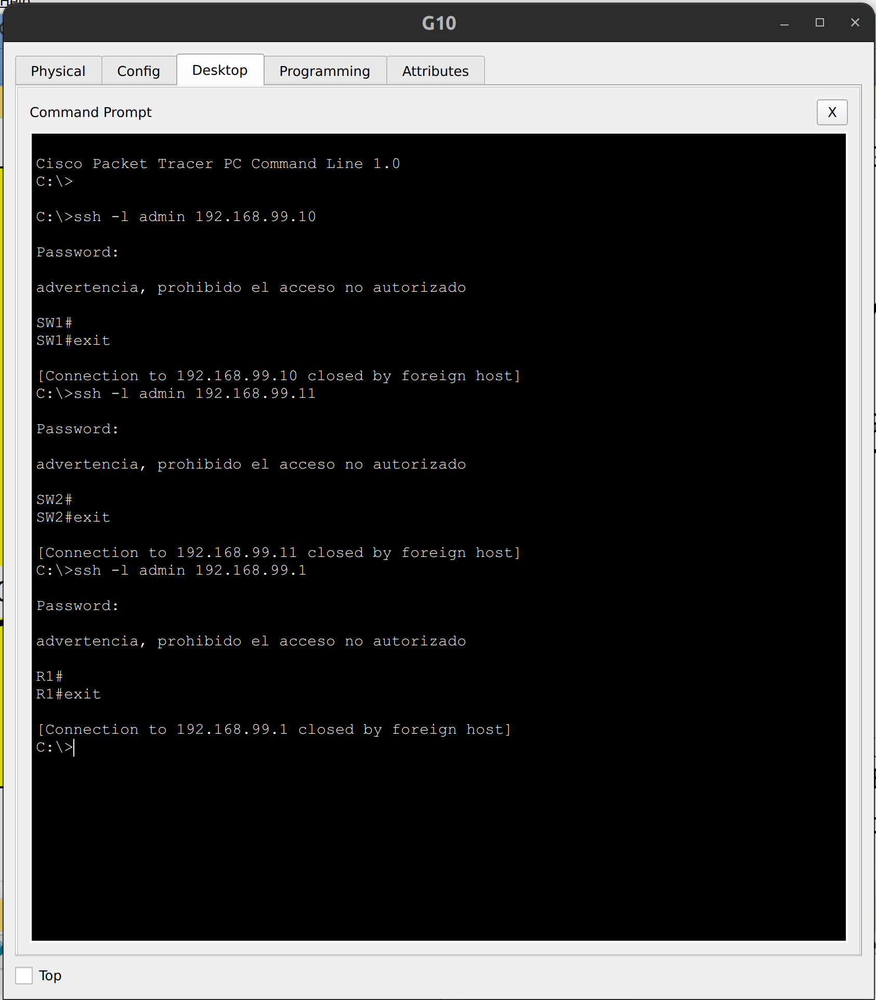

# CCNA Lab - Inter Vlan Routing - Router-on-Stick Part 2/2

## Solucion del laboratorio

### Parte 1: Parametros iniciales

#### SW1:
```text
Switch>
Switch>enable
Switch#configure terminal
Enter configuration commands, one per line.  End with CNTL/Z.
Switch(config)#hostname SW1
SW1(config)#banner motd "advertencia, prohibido el acceso no autorizado"
SW1(config)#line console 0
SW1(config-line)#password cisco
SW1(config-line)#login
SW1(config-line)#exit
SW1(config)#enable secret class
SW1(config)#service password-encryption

```

#### SW2:
```
Switch>
Switch>enable
Switch#configure terminal
Enter configuration commands, one per line.  End with CNTL/Z.
Switch(config)#hostname SW2
SW2(config)#banner motd "advertencia, prohibido el acceso no autorizado"
SW2(config)#line console 0
SW2(config-line)#password cisco
SW2(config-line)#login
SW2(config-line)#exit
SW2(config)#enable secret class
SW2(config)#service password-encryption
SW2(config)#
```

#### R1:
```
Router>
Router>enable
Router#configure terminal
Enter configuration commands, one per line.  End with CNTL/Z.
Router(config)#hostname R1
R1(config)#banner motd "advertencia, prohibido el acceso no autorizado"
R1(config)#line console 0
R1(config-line)#password cisco
R1(config-line)#login
R1(config-line)#exit
R1(config)#enable secret class
R1(config)#service password-encryption
R1(config)#
R1(config)#
```

### Parte 2: Acceso por SSH 

#### SW1, SW2 y R1:
```text
SW1#
SW1#configure terminal
Enter configuration commands, one per line.  End with CNTL/Z.
SW1(config)#ip domain-name mylab.com
SW1(config)#username admin secret letmein
SW1(config)#username admin privilege 15
SW1(config)#crypto key generate rsa 
The name for the keys will be: SW1.mylab.com
Choose the size of the key modulus in the range of 360 to 2048 for your
  General Purpose Keys. Choosing a key modulus greater than 512 may take
  a few minutes.

How many bits in the modulus [512]: 1024
% Generating 1024 bit RSA keys, keys will be non-exportable...[OK]
SW1(config)#line vty 0 15
*Mar 1 0:22:5.144: %SSH-5-ENABLED: SSH 1.99 has been enabled
SW1(config-line)#transport input ssh
SW1(config-line)#login local
SW1(config-line)#exit
SW1(config)#ip ssh version 2
SW1(config)#
```

### Parte 3: VLANs y puertos de switch
- Configure las VLANs en SW1 y SW2 de acuerdo ala información proporcionada en [tabla de vlans](#tabla-de-vlans)

```
SW1#configure terminal
Enter configuration commands, one per line.  End with CNTL/Z.
SW1(config)#vlan 101
SW1(config-vlan)#name pink
SW1(config-vlan)#exit
SW1(config)#vlan 110
SW1(config-vlan)#name green
SW1(config-vlan)#exit
SW1(config)#vlan 120
SW1(config-vlan)#name yellow
SW1(config-vlan)#exit
SW1(config)#vlan 99
SW1(config-vlan)#name mgmt
SW1(config-vlan)#exit
SW1(config)#
```

```
SW2#
SW2#configure terminal
Enter configuration commands, one per line.  End with CNTL/Z.
SW2(config)#vlan 101
SW2(config-vlan)#name pink
SW2(config-vlan)#exit
SW2(config)#vlan 110
SW2(config-vlan)#name green
SW2(config-vlan)#exit
SW2(config)#vlan 120
SW2(config-vlan)#name yellow
SW2(config-vlan)#exit
SW2(config)#vlan 99
SW2(config-vlan)#name mgmt
SW2(config-vlan)#exit
SW2(config)#
```

- Configure los puertos de acceso en SW1 y SW2 según la información proporcionada en la [tabla de asignación de puertos](#asignación-de-puertos-y-direccionamiento-ip) 


```
SW1(config)#
SW1(config)#interface fa0/1
SW1(config-if)#switchport mode access
SW1(config-if)#switchport access vlan 100
SW1(config-if)#exit
SW1(config)#interface fa0/2
SW1(config-if)#switchport mode access
SW1(config-if)#switchport access vlan 110
SW1(config-if)#exit
SW1(config)#interface fa0/3
SW1(config-if)#switchport mode access
SW1(config-if)#switchport access vlan 120
SW1(config-if)#exit
SW1(config)#
```

```
SW2(config)#
SW2(config)#interface f0/1
SW2(config-if)#switchport mode access
SW2(config-if)#switchport access vlan 110
SW2(config-if)#exit
SW2(config)#interface fa0/2
SW2(config-if)#switchport mode access
SW2(config-if)#switchport access vlan 120
SW2(config-if)#exit
SW2(config)#interface f0/3
SW2(config-if)#switchport mode access
SW2(config-if)#switchport access vlan 100
SW2(config-if)#exit
SW2(config)#

```

- Configure los enlaces troncales en SW1 y SW2 de acuerdo con la [tabla de asignación de puertos](#asignación-de-puertos-y-direccionamiento-ip). ***Unicamente debe permitir el tráfico de las vlans utilizadas en el ejercicio y rechazar cualquier trafico que pertenezca a otra VLAN.***

```
SW1(config)#
SW1(config)#interface g0/1
SW1(config-if)#switchport mode trunk
SW1(config-if)#switchport trunk allowed vlan 100,110,120,99
SW1(config-if)#exit
SW1(config)#
SW1(config)#interface g0/2
SW1(config-if)#switchport mode trunk
SW1(config-if)#switchport trunk allowed vlan 100,110,120,99
SW1(config-if)#exit
SW1(config)#
```

```
SW2(config)#
SW2(config)#interface g0/1
SW2(config-if)#switchport mode trunk
SW2(config-if)#switchport trunk allowed vlan 100,110,120,99
SW2(config-if)#exit
SW2(config)#
```


- Habilite las interfaces de administración en SW1 y SW2 y asigne las direcciónes IP, de acuerdo con la información [proporcionada](#asignación-de-puertos-y-direccionamiento-ip). 
- Configure lo necesario para que el switch puede ser alcanzado desde redes externas

```
SW1(config)#
SW1(config)#interface vlan 99
SW1(config-if)#ip address 192.168.99.10 255.255.255.0
SW1(config-if)#no shutdown
SW1(config-if)#exit
SW1(config)#ip default-gateway 192.168.99.1
SW1(config)#
```

```
SW2(config)#
SW2(config)#interface vlan 99
SW2(config-if)#ip address 192.168.99.11 255.255.255.0
SW2(config-if)#no shutdown
SW2(config-if)#exit
SW2(config)#ip default-gateway 192.168.99.1
SW2(config)#
```

 ### Parte 4: Enrutamiento inter vlan

- Configure en enrutamiento inter-vlan colocando la interfaz del router como puerto troncal mediante sub-interfaces y asigne las direcciónes IP según lo indicado en la [tabla](#asignación-de-puertos-y-direccionamiento-ip), no olvide habilitar la interfaz principal.
 
```
R1(config)#
R1(config)#interface G0/0/0.100
R1(config-subif)#encapsulation dot1q 100
R1(config-subif)#ip address 192.168.100.1 255.255.255.0
R1(config-subif)#exit
R1(config)#interface G0/0/0.110
R1(config-subif)#encapsulation dot1q 110
R1(config-subif)#ip address 192.168.110.1 255.255.255.0
R1(config-subif)#exit
R1(config)#interface G0/0/0.120
R1(config-subif)#encapsulation dot1q 120
R1(config-subif)#ip address 192.168.120.1 255.255.255.0
R1(config-subif)#exit
R1(config)#interface G0/0/0.99
R1(config-subif)#encapsulation dot1q 99
R1(config-subif)#ip address 192.168.99.1 255.255.255.0
R1(config-subif)#exit
R1(config)#interface G0/0/0
R1(config-if)#no shutdown
R1(config-if)#

```

### Parte 5: Direcciones de los hosts
- Asigne las direcciones IP a las PC's de acuerdo a la información [proporcionada](#asignación-de-puertos-y-direccionamiento-ip) 

#### Ejemplo P10



### Parte 6: Pruebas

#### Prueba de Ping


#### Prueba de SSH


