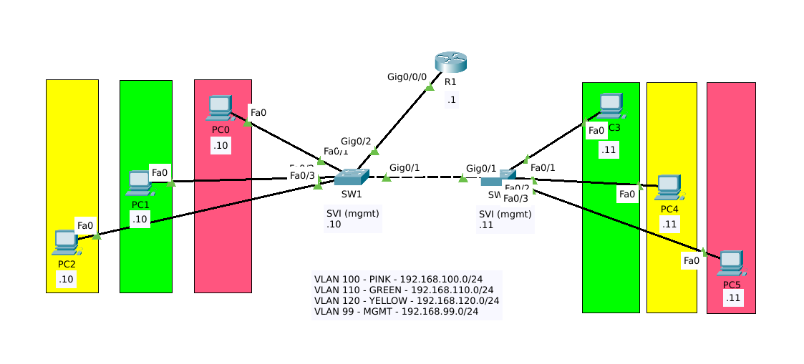

# Laboratorio CCNA - Inter Vlan Routing - Router-on-Stick

## Objetivo

El proposito de este laboratorio es configurar una red con 3 VLANs identificadas cada una por un color y 1 VLAN adicional para la administración de los equipos de red. Para el enrutamiento Inter VLAN se utiliza un router con sub-interfaces, una para cada VLAN, lo que comunmente se conoce como Router-on-Stick. Adicionalmente se deben configurar los parametros iniciales de los dispositivos de red.

## Topología 

## Información General

#### Tabla de VLANs

    
| Vlan ID    | Name      | Subnet           |
| ---------- |:---------:| ----------------:|
| 101        | pink      | 192.168.100.0/24 |
| 110        | green     | 192.168.110.0/24 |
| 120        | yellow    | 192.168.120.0/24 |
| 99         | mgmt      | 192.168.99.0./24 |

#### Asignación de puertos y direccionamiento IP
    
| Device   | Port   | Port Type | Vlan(s)   | IP address   |
| -------- |:------:| :--------:|:------:|------------  |
| SW1      | Fa0/1  | Access    | pink   |              |
| SW1      | Fa0/2  | Access    | green  |              |
| SW1      | Fa0/3  | Access    | yellow |              |
| SW1      | SVI    | Access    | mgmt   |192.168.99.10 |
| SW1      | Gi0/1  | Trunk     | ALL   ||
| SW1      | Gi0/2  | Trunk     | ALL   ||
| SW2      | Fa0/1  | Access    | green  |              |
| SW2      | Fa0/2  | Access    | yellow |              |
| SW2      | Fa0/3  | Access    | pink   |              |
| SW2      | SVI    | Access    | mgmt   | 192.168.99.11|
| SW2      | Gi0/1  | Trunk     | ALL   ||
| R1      | Gi0/0/0.100 | Trunk | pink   | 192.168.100.1|
| R1       | Gi0/0/0.110 | Trunk | green | 192.168.110.1|
| R1       | Gi0/0/0.120 | Trunk | yellow| 192.168.120.1|
| R1       | Gi0/0/0.99  | Trunk | mgmt  | 192.168.99.1| 
| P10      | eth  | Access | pink  | 192.168.100.10| 
| G10      | eth  | Access | green  | 192.168.110.10| 
| Y10      | eth  | Access | yellow  | 192.168.120.10| 
| P11      | eth  | Access | pink  | 192.168.100.11| 
| G11      | eth  | Access | green  | 192.168.110.11| 
| Y11      | eth  | Access | yellow  | 192.168.120.11| 

## Instrucciones

Parte 1: Parametros iniciales en R1, SW1 y SW2.
- Configure Hostname
- Configure un mensaje del dia que contenga la palabra `advertencia`
- Proteja el acceso a consola con el password `cisco`
- Proteja el acceso a EXE privilegiado con `class`
- Encripte las contraseñas en el archivo de configuración
  
Parte 2: Habilite el acceso por SSH a los dispositivos de red y cree un usuario local.
   - Configure un nombre de dominio `mylab.com`
   - Genere un par de llaves RSA con **1024bits ** para habilitar SSH.
   - Cree un usuario `admin` con contraseña segura `letmein` y el **maximo** privilegio
   - Habilite el acces por SSH en todas las terminales virtuales disponibles, asegurese de utilizar la base de datos local para la autenticación de usuarios.
   - Asegurese de estar utilizndo la version 2 del protocolo

Parte 3: Configuración de Vlans y puertos de switch

- Configure las VLANs en SW1 y SW2 de acuerdo ala información proporcionada en [tabla de vlans](#tabla-de-vlans)
- Configure los puertos de acceso en SW1 y SW2 según la información proporcionada en la [tabla de asignación de puertos](#asignación-de-puertos-y-direccionamiento-ip) 

- Configure los enlaces troncales en SW1 y SW2 de acuerdo con la [tabla de asignación de puertos](#asignación-de-puertos-y-direccionamiento-ip). ***Unicamente debe permitir el tráfico de las vlans utilizadas en el ejercicio y rechazar cualquier trafico que pertenezca a otra VLAN.***

- Habilite las interfaces de administración en SW1 y SW2 y asigne las direcciónes IP, de acuerdo con la información [proporcionada],(#asignación-de-puertos-y-direccionamiento-ip)
- Configure lo necesario para que el switch puede ser alcanzado desde redes externas

 Parte 4: Configuración de enrutamiento inter vlan en R1 (router-on-stick)
 - Configure la interfaz del router, como un puerto troncal y asigne las direcciónes IP indicadas en la [tabla](#asignación-de-puertos-y-direccionamiento-ip)

Parte 5: Asigne las direcciones IP a las PC's de acuerdo a la información [proporcionada](#asignación-de-puertos-y-direccionamiento-ip) 

Parte 6: Pruebas
- Si realizó toda la configuración correctamente, debe de poder hacer ping desde cualquier computadora a los demas host, incluyendo las SVI de los switches y las interfaces del router.
- Debe poder acceder por SSH a los switches y al router desde cualquier computadora.

----
> Intente realizar el laboratorio por su cuenta, si tiene alguna duda, puede consultar la solución [aqui.](2022-09-26-ccna-lab-intervlan-ros-answer.md)

    
    

