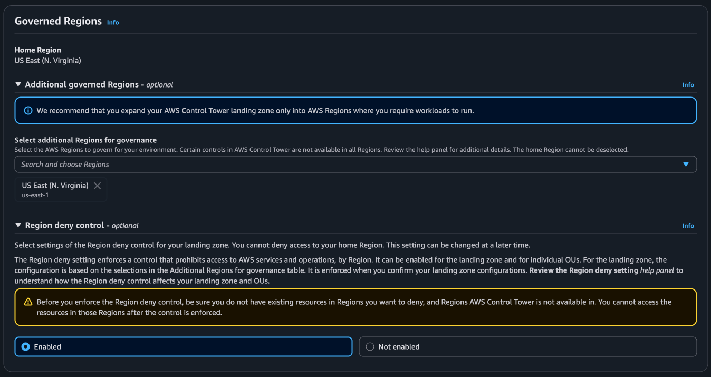
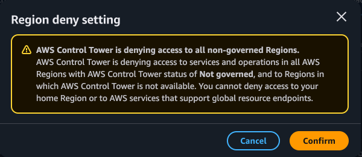
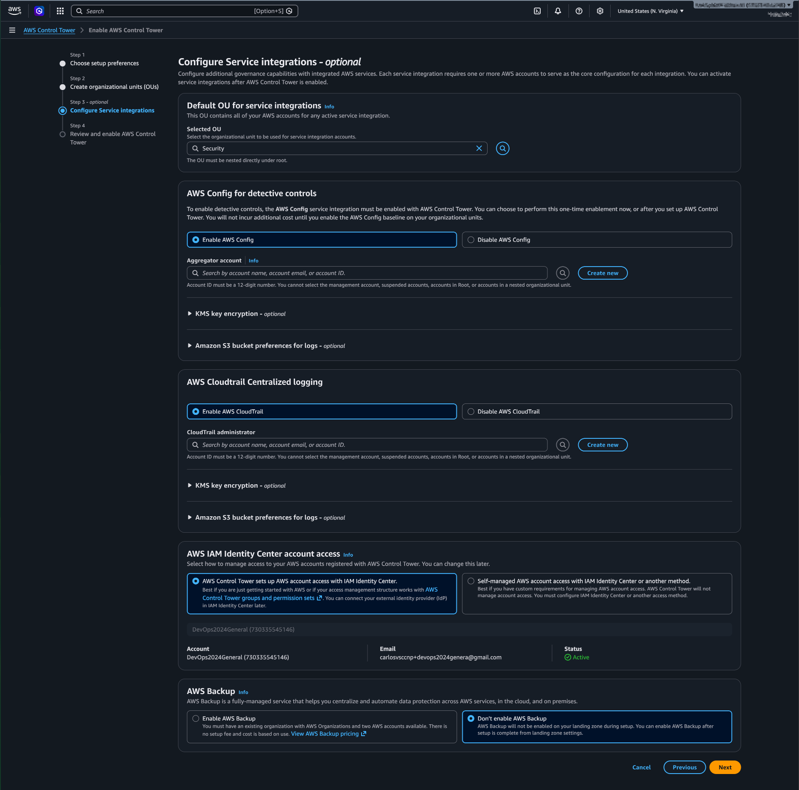
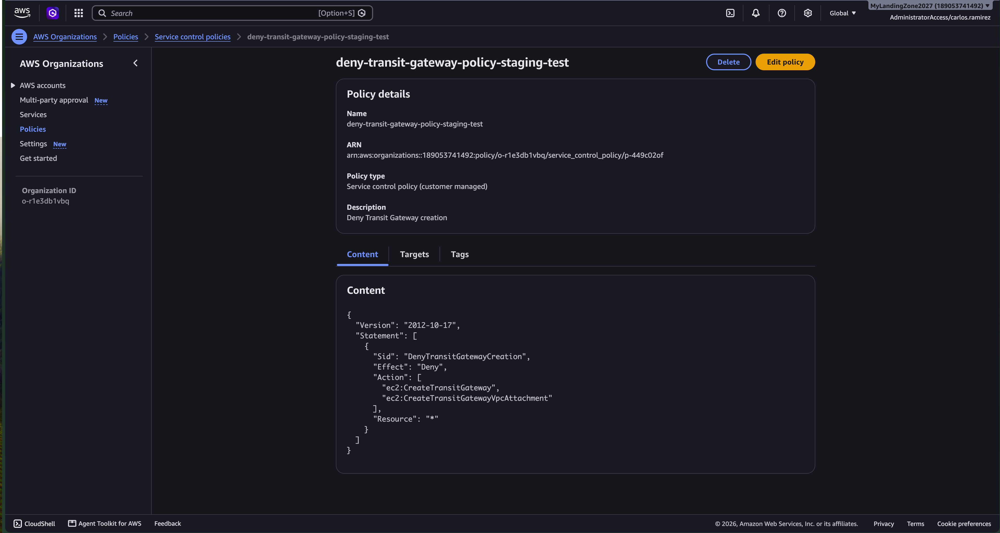
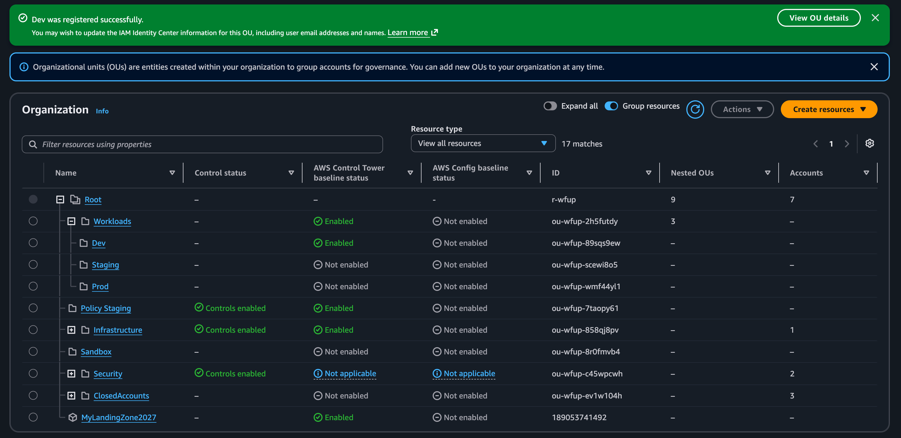
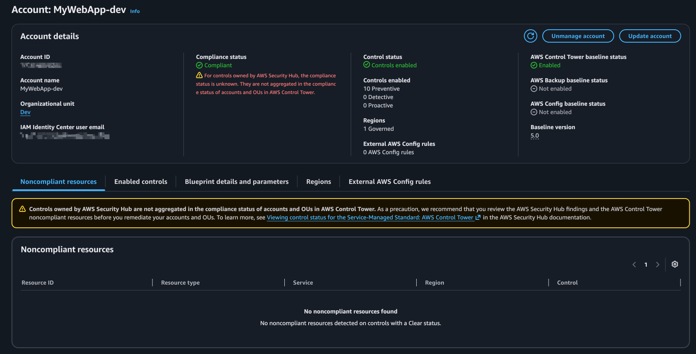
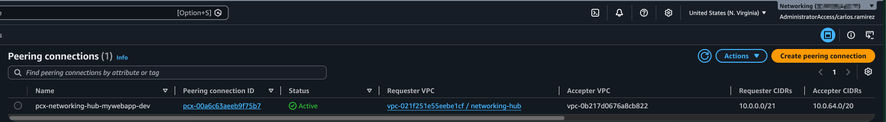
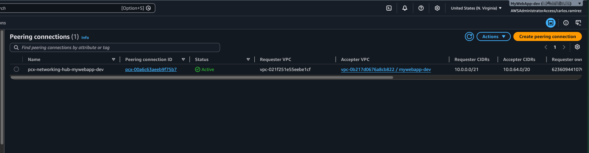
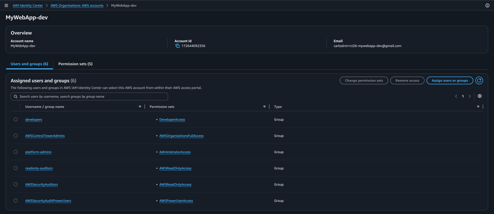
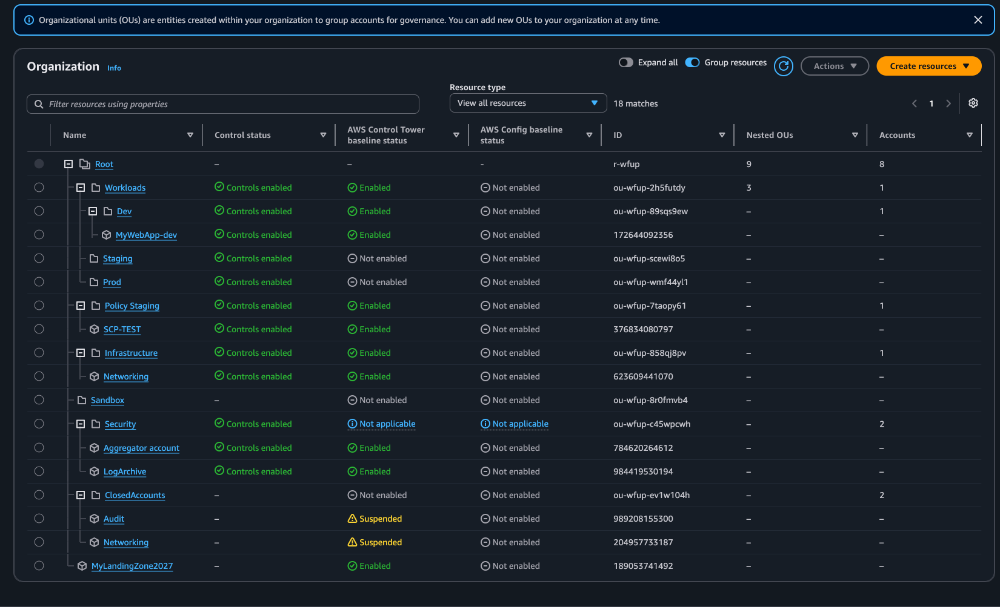

## Introducción

> De la cuenta única al entorno "Enterprise"

En este articulo te cuento como construí una Landing Zone en AWS para un entorno multi-cuenta utilizando Amazon Control Tower y Terraform, te explicó porque lo hice, cómo lo hice y las decisiones que tomé en el camino.

## Objetivo

Mi objetivo con este proyecto no era crear un laboratorio rápido para luego destruirlo, sino implementar una plataforma base en AWS que me sirva para alojar futuros proyectos personales de aprendizaje que pueda incluir en mi portafolio técnico, así como incorporar las cuentas aisladas que he creado con el tiempo y en donde tengo desplegados algunos servicios que uso de forma "productiva", como algún bucket S3 el hosted zone en Route53 de mi propio dominio personal.

### Requisitos principales

Antes de iniciar el proyecto tenia tres requisitos claros que quería mantener, a primera vista puede parecer que se contraponen uno con otro, pero cada uno tiene su razón de ser,espero que con las decisiones de arquitectura que tomé haya logrado conciliarnos.

El primero es que la plataforma tenía que parecerse lo más posible a un entorno _"enterprise"_ real. Mi intención es desplegar cargas de trabajo que cumplan los criterios que se les exigen a una aplicación en una empresa, los mismos que propone el AWS Well-Architected Framework: confiabilidad, seguridad, eficiencia de desempeño y excelencia operativa. Para eso, la plataforma debía ofrecer al menos cuatro capacidades:

- **Separación de ambientes:** ambientes bajos (desarrollo y pruebas) aislados de los productivos, cada uno en su propia cuenta.
- **Gobernanza preventiva:** controles a nivel de organización que sirvan de _guardrails_ que impidan ciertas acciones sin importar la cuenta y quien la esta operando.
- **Detección de desvíos:** mecanismos que identifiquen cuando un recurso o la propia landing zone se aparta de la configuración esperada (_drift_).
- **Auditoría centralizada:** registro de la actividad y la configuración de todas las cuentas en un solo lugar.

El segundo requisito corresponde a otro pilar del _Well-Architected Framework_, la optimización de costos. La plataforma debía mantener con una disciplina de costos estricta, en especial en su costo base, es decir lo que cuesta solo por existir y sin cargas de trabajo desplegadas. Dado que el uso por ahora es personal y en presupuesto sale de mi bolsillo, el objetivo era mantenerme por debajo de USD 10 al mes.

Previamente ya había experimentado con Control Tower y a las malas descubrí que AWS Config puede generar costos inesperados si no se configura adecuadamente, En esta ocasión espero que esas lecciones aprendidas me sirvan de algo.

El tercer requisito es lo contrario al primero, ya que también necesitaba un espacio aislado para pruebas rápidas y laboratorios sencillos, el cual tuviera una gobernanza mínima, lo que significa menos reglas que en un entorno empresarial (sin varios ambientes ni etiquetado obligatorio, etc.) pero con los mismos límites de seguridad y costo que protegen al resto de la organización. Un ambiente sandbox que me dé libertad para experimentar, pero sin generar una factura inesperada.

## ¿Qué es una Landing Zone?

Por lo general las organizaciones y las personas inician sus primeros pasos en la nube de AWS desplegando servicios en cuentas aisladas, probablemente sin ningún tipo de estandarización o gobernanza.

Un paso natural y casi obligatorio cuando el uso de los servicios de nube empieza a proliferar en la organización y varios equipos empiezan a crear cuentas y desplegar recursos es estandarizar, agrupar todas las cuentas individuales bajo una misma organización, e implementar mecanismos de control y gobernanza que permitan el despliegue rápido de aplicaciones pero en un ambiente ordenado, escalable y seguro.

En el momento que la organización decide adoptar formalmente su camino a la nube, se introduce el concepto de _Landing Zone_, en donde la idea es que sirva de zona de aterrizaje para las aplicaciones y cargas de trabajo dentro de un entorno AWS multi-cuenta controlado, seguro y con una arquitectura adecuada.

## AWS Control Tower y Terraform

Para implementar esta _Landing Zone_, utilicé el servicio de **AWS Control Tower**, el cual permite orquestar de forma automatizada servicios clave como AWS Organizations, AWS Service Catalog e IAM Identity Center, aplicando controles continuos (_guardrails_) que evitan desviaciones (_drifts_) de seguridad.

Uno de los principales beneficios de implementar _Control Tower_ es que permite aplicar controles (llamados _guardrails_) los cuales ayudan a evitar que existan _drifts_ o desvíos entre las cuentas. **AWS Control Tower** permite adherirse de forma fácil a estándares corporativos, ayuda a establecer una base para el cumplimiento de requerimientos regulatorios y seguir las mejores prácticas de arquitectura cloud.

Cabe mencionar que **AWS Control Tower** es la forma estándar de crear una Landing Zone en AWS; sin embargo landing zones personalizadas para casos muy específicos, lo que se recomienda es partir de Control Tower y evolucionar si hace falta.

Toda la infraestructura que abarca la organización la gestioné con **Terraform**, por ejemplo las Service Control Policies (SCPs) y los componentes de red transversales, como la VPC de la cuenta Networking, la cual actúa como un hub, así como las conexiones de peering. De este modo cada cambio queda versionado y es revisable antes de aplicarse.

También creé módulos reutilizables (por ejemplo, una VPC base para las cuentas tipo Workload y otro para las tipo Sandbox) para que, cuando haga falta crear recursos en una cuenta nueva, todas partan del mismo estándar y no de configuraciones hechas a mano.

Los recursos administrados por Control Tower quedaron deliberadamente fuera de Terraform para evitar drift en la landing zone.

## Requisitos previos

Antes de desplegar Control Tower, partí de una cuenta _standalone_ de AWS, es decir, una cuenta que no pertenecía a ninguna organización. Esa cuenta se convirtió en la cuenta de administración (_management account_) de la nueva organización de AWS.

En esta cuenta configuré lo siguiente:

- **MFA para el usuario root.**
- **Un usuario IAM temporal** con MFA y _access keys_, para trabajar desde la CLI durante la configuración inicial. Más adelante lo reemplacé por IAM Identity Center y un usuario _break-glass_ dedicado, porque no conviene mantener credenciales de larga duración en la cuenta de administración.
- **Control de costos antes de desplegar nada:**
  - Activé el acceso de usuarios y roles IAM a la información de facturación.
  - Creé un presupuesto en AWS Budgets.
  - Habilité las alertas de facturación de CloudWatch y creé una alarma como respaldo del presupuesto.

## Definiciones iniciales para Control Tower

Con la cuenta de administración con todas las de la ley, tenía que tomar algunas decisiones antes de ejecutar el asistente de Control Tower. Algunas no se pueden cambiar después sin rehacer la landing zone.

### Regiones

- **Región principal (_home region_):** `us-east-1`. Es la región donde Control Tower despliega sus recursos base. Conviene elegirla con cuidado, porque no se puede cambiar después sin desmantelar la landing zone.
- **Regiones gobernadas adicionales:** ninguna por ahora. Si más adelante monto un laboratorio de _Disaster Recovery_ en una región alterna y quiero que Control Tower también la gobierne, la agregaré entonces.
- **Denegar el uso de regiones no gobernadas:** lo activé para bloquear cualquier despliegue de recursos fuera de `us-east-1`. Así evito costos inesperados y recursos olvidados en otras regiones.

### Cuentas de integración de servicios

Control Tower 4.0 pide dos cuentas compartidas, que llama _service integration accounts_ ([documentación](https://docs.aws.amazon.com/controltower/latest/userguide/special-accounts.html)):

- **CloudTrail administrator account:** centraliza los logs de CloudTrail de toda la organización.
- **Config Aggregator account:** agrega la información de AWS Config de todas las cuentas de la organización.

Estas cuentas pueden crearse durante el asistente o pueden ser cuentas existentes. El asistente sugiere nombres, pero puedes usar los que quieras. Ambas deben estar en la misma OU: el asistente recomienda una OU llamada `Security`, aunque puedes elegir otra existente o darle otro nombre.

> **Note:** > Por costumbre de versiones anteriores, a mi CloudTrail administrator account le puse `LogArchive`. Te recomiendo usar los nombres que propone el asistente para mantener la nomenclatura de Control Tower 4.0. Así tu landing zone coincide con la documentación actual.

- **Un correo electrónico único por cuenta:** AWS exige una dirección distinta para el usuario root de cada cuenta. En lugar de crear buzones nuevos, usé alias con el signo `+` (por ejemplo, `usuario+cloudtrail@gmail.com`). Todos los correos llegan a la misma bandeja.

> **Tip:** > Si vienes de guías de versiones anteriores de **Control Tower**: la 4.0 ya no usa las cuentas _Log Archive_ y _Audit_. En su lugar, el asistente pide una _CloudTrail administrator account_ y una _Config Aggregator account_.

## Decisiones de Arquitectura

Además de las definiciones iniciales, tomé una serie de decisiones arquitectónicas que determinaron cómo se implementó la _Landing Zone_. Estas decisiones se documentaron en el formato estándar _Architecture Decision Record_ (ADR) y están disponibles en el repositorio del proyecto, en la sección de [adr](https://github.com/CarlosLRamirez/aws-multi-account-landing-zone/tree/main/docs/adr).

### Estructura de OUs

[ADR-001: Organizational Units (OU)](https://github.com/CarlosLRamirez/aws-multi-account-landing-zone/blob/main/docs/adr/ADR-001-OU-Structure.md)

- Ademas de la `OU Security` para las cuentas de servició , decidí crear 2 OUs de nivel uno para desplegar cuentas de usuarios o cargas de trabajo: `OU Workload`y `OU Sandbox`.
- En la `OU Worklods` viviran cuentas de proyectos tipo empresarial en donde según descrito en los #Requisitos principales se espera un entorno multi-ambiente, es por eso que se crearon tres OUs separadas para cada uno: `Dev`, `Staging` y `Prod`.
- En la `OU Sandbox` ira cuentas donde pienso desplegar pruebas o proyectos simples donde no se requiere la rigurosidad de una ambiente empresarial.
- También crearé una OU llamada `Infrastructure` cuyo objetivo es alojar cuentas para servicios transversales como la cuenta de `Networking` la cual esta destinada a los servicios de conectividad centralizada (más detalle en #Networking Centralizado).
- Adicionalmente se contemplan otras dos OUs:
  - Policy Staging: Destinada para una cuenta especial para hacer pruebas de SCs de manera aislada sin afectar toda la organización.
  - ClosedAccounts: Aqui se colocarán todas las cuentas que han sido borradas y aún esan en proceso de que AWS configure su borrado completamente, el cual toma alrededor de 90 dias.

Árbol final de la estructura de OUs para la Landing Zone:

```text
Root
├── Security OU          (Service integration accounts — gestionadas por Control Tower)
├── Infrastructure OU    (Servicios transversales: Networking, Shared, etc.)
├── Sandbox OU           (Ambiente aislado para pruebas)
├── Workloads OU         (Cuentas para aplicaciones enterprise multi-ambiente)
│   ├── Dev OU           (Ambiente de Desarrollo)
│   ├── Staging OU       (Ambiente de Pre-Productivo o de Certificacion)
│   └── Prod OU          (Ambiente Productivo)
├── Policy Staging OU    (Cuentas "cuarentena" para probar SCPs)
└── ClosedAccounts OU    (cuentas cerradas esperando los 90 días; no registrada en CT)
```

### Cuentas  base o fundacionales

[ADR-002 — Cuentas fundacionales](https://github.com/CarlosLRamirez/aws-multi-account-landing-zone/blob/main/docs/adr/ADR-002-Foundational-Accounts.md)

- Otra preuba de que tan facil es
- Cuenta management **nueva y limpia**; la cuenta existente con el dominio en Route 53 **no** se usó como management — entrará después como miembro bajo Infrastructure (el hosted zone no se mueve, solo la cuenta se une a la organización).
- CT v4.0 pide "Config Aggregator Account" y "CloudTrail Administrator" como roles separados, no una cuenta "Audit" genérica.

### **ADR-003 — Guardrails (3 SCPs propias)**

| #   | SCP                                                          | Aplicada a                                                          |
| --- | ------------------------------------------------------------ | ------------------------------------------------------------------- |
| 1   | Restringir tipos de EC2 (`t2.micro`, `t3.micro`, `t3.small`) | Dev, Staging, Sandbox                                               |
| 2   | Denegar creación de Transit Gateway                          | Todas las OUs excepto Security — sin excepción ni para `Networking` |
| 3   | Tags obligatorios (`Project` + `Environment`) en EC2/RDS/S3  | Workloads (heredado por Dev/Staging/Prod)                           |

- El alcance cambió respecto a la propuesta original: #1 y #3 se **acotaron**; #2 se **amplió** a toda la organización.
- CT ya despliega 13 controles preventivos obligatorios en la Security OU → no replicarlos como SCPs propias.
- Las SCPs **no aplican a la cuenta management** (restricción de diseño de Organizations, no un hueco) → su seguridad depende de IAM + Identity Center + MFA.

### Networking Centralizado

- TGW es lo "correcto" a escala, pero tiene costo por hora + por GB que no se justifica aquí → peering hub-and-spoke hacia una cuenta `Networking`, **sin peering spoke-to-spoke**.
- Sin NAT Gateway por ahora (las subnets privadas no tienen salida — deliberado, revisable).
- Plan de CIDR jerárquico estilo enterprise, con pools de reserva (ver sección 7).

**ADR-005 — IaC con Terraform**

- State en S3 en la cuenta management (decisión por costo, temporal, con ruta de migración documentada).
- Locking con el lockfile nativo de S3 (Terraform ≥ 1.10) → **sin DynamoDB**.
- Un solo backend/state, alcanzando cuentas miembro con _provider aliases_ que asumen un rol cross-account.
- Lo gestionado por Control Tower queda **fuera** del state.

---

## Despliegue con el asistente de Control Tower

> **Todo:** ✍️ Recorrido pantalla por pantalla: una línea por captura indicando qué decisión se aplica en ella.

**Regiones gobernadas:**



**Denegación de regiones no gobernadas:** al activarla, el asistente muestra esta advertencia: [TODO: resumir qué dice].



**OU y cuentas de integración de servicios:**



---

## 5. Ejecución, fase 1 — lo que hice a mano

> **Todo:** ✍️ Escribe aquí

### 5.1 Cuenta management y control de costos

- Cuenta nueva desde cero, root con MFA.
- Acceso de IAM a la información de Billing, un **Budget** y una **alarma de CloudWatch** de respaldo (Budgets puede tardar horas en refrescar). Hecho el 2026-08-17, antes del wizard.
- Usuario IAM temporal con access keys para el bootstrap → luego eliminado y reemplazado (ver 5.4).
- Grabaste un video en OBS de esta parte. _(¿Lo incluyes o enlazas?)_

### 5.2 El wizard de Control Tower (2026-08-17) — no salió a la primera

- Una sesión expiró a mitad del wizard. Quedó creada una cuenta `Audit` que luego cerraste.
- En el reintento, CT v4.0 creó una cuenta nueva **"Aggregator account"** para cumplir ambos roles (Config aggregator + CloudTrail admin), además de `LogArchive`.
- Resultado: 3 cuentas miembro en vez de 2, con nombres distintos a los planeados. La `Audit` cerrada quedó inerte, esperando los 90 días.
- El wizard también creó una `Sandbox` OU por defecto — encajaba con el diseño, se quedó.

### 5.3 OUs adicionales y la cuenta de pruebas

- Creadas a mano: Infrastructure, Workloads, Dev, Staging, Prod, Policy Staging.
- Cuenta `SCP-test` creada con Account Factory dentro de Policy Staging.

### 5.4 Identidad y accesos — Identity Center + break-glass

- **Grupos** = identidad funcional: `platform-admins`, `developers`, `readonly-auditors`.


- **Permission sets**: `AdministratorAccess` (AWS managed, sesión 1 h), `ReadOnlyAccess` (AWS managed, 4 h), `DeveloperAccess` (custom, inline policy).


- Detalle interesante para el post: `iam:PassRole` restringido con `iam:PassedToService` a Lambda y EC2 (evita escalamiento de privilegios y satisface la advertencia de IAM sobre PassRole con comodín).

```json
{
  "Version": "2012-10-17",
  "Statement": [
    {
      "Sid": "DeveloperServicesAccess",
      "Effect": "Allow",
      "Action": [
        "ec2:*",
        "s3:*",
        "lambda:*",
        "logs:*",
        "cloudwatch:*",
        "iam:GetRole",
        "iam:GetPolicy",
        "iam:ListRoles",
        "iam:ListPolicies"
      ],
      "Resource": "*"
    },
    {
      "Sid": "PassRoleToTrustedServicesOnly",
      "Effect": "Allow",
      "Action": "iam:PassRole",
      "Resource": "*",
      "Condition": {
        "StringEquals": {
          "iam:PassedToService": ["lambda.amazonaws.com", "ec2.amazonaws.com"]
        }
      }
    }
  ]
}
```

- **Asignaciones grupo → cuenta → permission set** (management: admins = Admin, auditors y developers = ReadOnly; SCP-test: admins y auditors).


- **Usuarios**: `carlos.ramirez` (platform-admins + developers) y `carlosvsccnp` (solo developers, para simular el punto de vista de un developer). Se borró el usuario que creó el wizard por defecto y se personalizó la URL del portal.
- Lo que ve cada usuario al entrar al portal:


- Flujo de login (tenías este diagrama):

```text
Usuario entra al portal de Identity Center
        ↓
Ve las cuentas a las que tiene acceso (según sus grupos)
        ↓
Elige una cuenta y un permission set
        ↓
Identity Center genera credenciales temporales (1–4 h)
        ↓
Opera en esa cuenta con esos permisos; las credenciales expiran solas
```

- Punto fuerte: **nunca hay credenciales de larga duración en el flujo normal**.
- **Break-glass** (sección que tenías como _Placeholder_): usuario IAM `breakglass` con consola + MFA y una única política inline que solo permite `sts:AssumeRole` sobre `BreakGlassAdminRole`; el rol tiene AdministratorAccess y su trust policy exige `aws:MultiFactorAuthPresent: true` y está limitado a ese usuario. No quedan otros usuarios IAM en la management.

```text
Normal:        Identity Center → grupo → permission set → credenciales temporales
Emergencia:    breakglass + MFA → Switch role → BreakGlassAdminRole → credenciales temporales
Recuperación:  root → solo operaciones exclusivas de root
```

### 5.5 SCPs probadas a mano en la "cuarentena" (Policy Staging)

- Metodología: adjuntar la SCP a Policy Staging → probar en `SCP-test` (caso negativo + positivo) → desadjuntar. Las políticas se conservan para reutilizarlas en Terraform.
- Truco de costo: `ec2:RunInstances --dry-run` evalúa permisos (incluidas SCPs) **sin crear nada**. `rds:CreateDBInstance` no tiene dry-run → probarlo significaría crear una instancia real.
- Primera prueba de SCP #2 con una copia de prueba (`deny-transit-gateway-policy-staging-test`):



- Grabaciones de pantalla de esa sesión (útiles si quieres hacer un GIF):
  - Creación de la SCP #2: 
  - Prueba negativa (falla al crear un TGW): 
  - Desadjuntar la SCP #2 (sin borrarla): 
- SCP #3 con S3: bucket sin tags → `AccessDenied` por SCP; bucket con tags → creado (y luego borrado a mano — S3 no tiene dry-run).
- Los outputs "limpios" de las pruebas están en la sección 8 (ronda de verificación final).

---

## 6. Ejecución, fase 2 — pasando todo a Terraform

> **Todo:** ✍️ Escribe aquí — "Aquí sí viene la parte interesante: aplicar Terraform sobre todo lo que hasta ahora había construido a mano." (frase tuya del borrador)

### 6.1 Bootstrap del backend (el problema del huevo y la gallina)

_(texto tuyo, del borrador)_

Este bucket, lógicamente, también se crea con Terraform — lo que plantea un problema de huevo y gallina: no puedo guardar el state de "quién creó el bucket de state" dentro de ese mismo bucket. La solución es un mini-Terraform aparte, aislado, cuyo único propósito es crear esta infraestructura de soporte. Su propio state se guarda en local (un único archivo) y, una vez creado el bucket, casi nunca se vuelve a tocar.

**Material en bruto:**

- `terraform/bootstrap/`: bucket S3 con versionado, bloqueo de acceso público, cifrado SSE-S3. Provider AWS `~> 5.0` (v5.100.0).
- Resultado: `Plan: 4 to add` → `Apply complete! Resources: 4 added`. Primer recurso real del proyecto creado con Terraform (2026-09-02).
- Luego el `main.tf` "real" en `terraform/` con el bloque `backend "s3"` (bucket, `key`, profile, `use_lockfile = true` → sin DynamoDB).

### 6.2 Adoptar lo que ya existía sin romperlo (`terraform import`)

- Escribiste en `.tf` las 7 OUs no gestionadas por CT y las 3 SCPs **describiendo exactamente lo que ya existía**, sin recrear nada. Los JSON de las políticas se leen con `file(...)`, no se duplican en el `.tf`.
- Al listar SCPs aparecen `aws-guardrails-*`: son los controles internos de Control Tower → **fuera de Terraform**; solo se importan las 3 propias.
- A propósito **no** declaraste attachments todavía: las SCPs estaban "detached" en AWS y el `.tf` debía reflejar exactamente eso. Adjuntarlas es un cambio de comportamiento → paso aparte.

```bash
terraform import aws_organizations_organizational_unit.workloads <ou-id>
# ... 7 OUs en total
terraform import aws_organizations_policy.deny_transit_gateway <policy-id>
# ... 3 SCPs en total
```

- **La anécdota:** el primer `terraform plan` post-import no dio "No changes" — quería borrar el `description` de las 3 políticas porque el `.tf` no lo declaraba:

```text
  # aws_organizations_policy.deny_transit_gateway will be updated in-place
  ~ resource "aws_organizations_policy" "deny_transit_gateway" {
      - description = "Deny Transit Gateway creation" -> null
        ...
    }

Plan: 0 to add, 3 to change, 0 to destroy.
```

- Fix: agregar el `description` exacto → `No changes. Your infrastructure matches the configuration.`

### 6.3 Activar los guardrails

- Attachments SCP → OU declarados en `terraform/scps.tf` y aplicados el 2026-09-03 (SCP #1 extendida a Sandbox el 2026-09-08). `terraform plan` posterior: sin drift.
- Después cerraste la cuenta `SCP-test` (Organizations → Actions → Close)… y más tarde tuviste que reabrirla (sección 8).

---

## 7. Networking — hub-and-spoke y un plan de direccionamiento "enterprise"

> **Todo:** ✍️ Escribe aquí

**Material en bruto:**

- **Dos diseños de VPC distintos**, porque `Networking` no es una cuenta de workloads (lo detectaste tú: un solo módulo "VPC estándar" era un error):
  - Hub `Networking`: sin IGW, solo subnets privadas + subnets "Public (Future)" reservadas para un egress centralizado futuro. Su trabajo es concentrar peering (y más adelante una VPN site-to-site), no exponer nada a internet.
  - Workloads: módulo reutilizable `vpc-baseline` — 3 AZ, capas Public / App / Data + un slot reservado por AZ.
  - Sandbox: módulo propio más pequeño `vpc-sandbox` (`/23` → `/26`, 2 AZ).
- **Plan de CIDR jerárquico** (revisado el 2026-09-07; sustituyó un plan plano de 5 × `/20`):

| Bloque                         | Uso                                                     |
| ------------------------------ | ------------------------------------------------------- |
| `10.0.0.0/21`                  | Networking (hub)                                        |
| `10.0.8.0/21`                  | Shared Services (reservado)                             |
| `10.0.16.0/21`–`10.0.40.0/21`  | 4 × `/21` reservados para tooling transversal/seguridad |
| `10.0.48.0/23`–`10.0.62.0/23`  | Pool Sandbox: 8 × `/23`                                 |
| `10.0.64.0/20`–`10.0.176.0/20` | Pool Dev: 8 × `/20`                                     |
| `10.0.192.0/20`–`10.1.48.0/20` | Pool Staging: 8 × `/20`                                 |
| `10.1.64.0/20`–`10.1.176.0/20` | Pool Prod: 8 × `/20`                                    |

- Los pools de 8 slots son **margen de direccionamiento**, no un compromiso de crear 8 cuentas por entorno.
- Cambiar el CIDR primario de una VPC no se puede en caliente → reconstruir el hub (bajo riesgo: aún sin peerings).

### 7.1 La cuenta `Networking`, versión 2: nacer gestionada por Control Tower

- La primera `Networking` la creaste con Terraform (`aws_organizations_account`) → **nunca tuvo baseline de Control Tower** (ni CloudTrail/Config de CT ni rol `AWSControlTowerExecution`).
- Decisión (2026-09-07): cerrarla y recrearla con Account Factory. Tropiezos en el camino:
  1. `terraform destroy` agotó su timeout de 10 min esperando el cierre, aunque el cierre sí ocurrió → limpieza con `terraform state rm`.
  2. **Control Tower se negó a registrar una OU con cuentas `SUSPENDED`/`CLOSED`** → nació la `ClosedAccounts` OU (no registrada, solo sala de espera). No estaba prevista en el diseño.
  3. Account Factory falló con `AdministratorAccess`: el acceso al portafolio de Service Catalog es una capa **separada** de la política IAM. Agregarte al grupo `AWSAccountFactory` lo arregló… y rompió el acceso a la consola de CT. Solución final: dar acceso al portafolio de Account Factory directamente al rol SSO de `AdministratorAccess`.
  4. Account Factory la nombró `NetworkingAccount` → renombrada desde Billing → Account settings (Organizations no permite renombrar).
  5. Provider alias ahora asume `AWSControlTowerExecution` (no `OrganizationAccountAccessRole`). `terraform apply`: 15 recursos, limpio.

---

## 8. Primera cuenta de workload: `MyWebApp-dev` + primer VPC Peering

> **Todo:** ✍️ Escribe aquí

**Material en bruto:**

- Registrar `Dev` en Control Tower exigió registrar **primero la OU padre** `Workloads` — el registro no cae en cascada a las hijas.



- Cuenta creada con Account Factory en `Workloads/Dev` (2026-09-14). Tardó casi 10 min en quedar todo _Enabled_.



- Guardrails heredados automáticamente al caer en `Dev`: SCP #1, #2 y #3, sin crear nada nuevo.
- Primera instancia real del módulo `vpc-baseline` (CIDR `10.0.64.0/20`, slot 1 del pool Dev) → 22 recursos. Tuviste que declarar `required_providers` en el módulo para quitar un warning del plan.
- Peering cross-account hub ↔ `MyWebApp-dev`: _requester_ en el hub + _accepter_ explícito en la cuenta nueva (`auto_accept` solo funciona dentro de la misma cuenta). Las rutas de ambos lados llevan `depends_on` al accepter, porque AWS no deja crear rutas sobre un peering que aún no está `active`.





- **El "footgun" de Terraform (buena historia para el post):** después de crear el peering, el siguiente `terraform plan` quería **borrar la ruta del peering** en la route table pública. Causa: el módulo declaraba la ruta al IGW como bloque `route { }` inline, y eso convierte ese bloque en la única fuente de verdad de toda la tabla — cualquier `aws_route` externo queda marcado para eliminar. Fix: sacar la ruta a un recurso `aws_route` separado e **importar** la ruta existente (si no, `RouteAlreadyExists`):

```hcl
resource "aws_route" "public_internet_gateway" {
  route_table_id         = aws_route_table.public.id
  destination_cidr_block = "0.0.0.0/0"
  gateway_id             = aws_internet_gateway.this.id
}
```

```bash
terraform import 'module.mywebapp_dev_vpc.aws_route.public_internet_gateway' <rtb-id>_0.0.0.0/0
```

→ `No changes`. Como el fix quedó en el módulo compartido, Staging/Prod ya no lo van a sufrir.

- Acceso en Identity Center asignado: `platform-admins`, `developers` (por fin una cuenta Dev real para ese grupo) y `readonly-auditors`. Crear la cuenta no da acceso a nadie automáticamente.



> **Warning:** Esta captura muestra el correo y el Account ID sin redactar. Usa la versión redactada del repo (`docs/evidence/`) o redáctala antes de publicar.

- Límite de la landing zone: con esto la cuenta y la red están listas. Security Groups, ALB y EC2 pertenecen al repo de la aplicación, no a la landing zone.
- Decisión de no usar `MyWebApp-dev` para probar SCPs: no ensuciar una cuenta real con intentos fallidos a propósito → la verificación se movió a `SCP-test` (sección 9).

---

## 9. Verificar los guardrails de verdad (reabrir `SCP-test`)

> **Todo:** ✍️ Escribe aquí

**Material en bruto:**

- El README tenía pendiente desde el 2026-09-03 la evidencia formal (un caso denegado + uno permitido por SCP). La cuenta `SCP-test` ya estaba cerrada → **ticket de soporte para reabrirla** (2026-09-14).
- Se movió de `ClosedAccounts` a `Policy Staging`. SCP #2 ya estaba adjunta ahí de forma permanente; #1 y #3 se adjuntaron **temporalmente por CLI, fuera de Terraform** (un attach de prueba no es una decisión de guardrail permanente → no va en `.tf`), y luego se desadjuntaron.
- Decisión final: `SCP-test` queda **activa pero sin uso** en `Policy Staging`. No se vuelve a cerrar (evita repetir cerrar → ticket → reabrir) ni se manda a `ClosedAccounts` (esa OU no está registrada en CT: tener ahí una cuenta activa le quitaría gobernanza).
- Snippets **ya saneados** para el post (IDs sustituidos, mensaje codificado recortado):

SCP #1 — tipo de instancia no permitido (`t3.medium`), denegado:

```text
$ aws ec2 run-instances --dry-run --image-id <ami-id> --instance-type t3.medium \
    --subnet-id <subnet-id> \
    --tag-specifications 'ResourceType=instance,Tags=[{Key=Project,Value=scp-verification},{Key=Environment,Value=test}]'

An error occurred (UnauthorizedOperation) when calling the RunInstances operation: You are not
authorized to perform this operation. User: arn:aws:sts::<account-id>:assumed-role/AWSReservedSSO_AdministratorAccess_.../<user>
is not authorized to perform: ec2:RunInstances on resource: arn:aws:ec2:us-east-1:<account-id>:instance/*
with an explicit deny in a service control policy: arn:aws:organizations::<mgmt-account-id>:policy/<org-id>/service_control_policy/<policy-id>.
Encoded authorization failure message: ...
```

SCP #3 — tipo permitido pero sin tags obligatorios, denegado:

```text
$ aws ec2 run-instances --dry-run --image-id <ami-id> --instance-type t3.micro --subnet-id <subnet-id>

An error occurred (UnauthorizedOperation) when calling the RunInstances operation: ...
is not authorized to perform: ec2:RunInstances ... with an explicit deny in a service control policy: ...
```

SCP #1 + #3 — tipo permitido y con tags, permitido:

```text
$ aws ec2 run-instances --dry-run --image-id <ami-id> --instance-type t3.micro \
    --subnet-id <subnet-id> \
    --tag-specifications 'ResourceType=instance,Tags=[{Key=Project,Value=scp-verification},{Key=Environment,Value=test}]'

An error occurred (DryRunOperation) when calling the RunInstances operation: Request would have
succeeded, but DryRun flag is set.
```

SCP #2 — crear Transit Gateway, denegado:

```text
$ aws ec2 create-transit-gateway --dry-run

An error occurred (UnauthorizedOperation) when calling the CreateTransitGateway operation: ...
is not authorized to perform: ec2:CreateTransitGateway ... with an explicit deny in a service control policy: ...
```

SCP #2 — mismo servicio, acción de lectura, permitido (el bloqueo es específico, no a todo EC2):

```text
$ aws ec2 describe-transit-gateways
{
    "TransitGateways": []
}
```

- Estado final de la organización en Control Tower:



> **Warning:** Esta captura muestra todos los Account IDs y OU IDs. Decide si la redactas o la reemplazas por el árbol en texto de la sección 4.

---

## 10. (Opcional) Compartir la landing zone con un proyecto: BrewOps

> **Todo:** ✍️ ¿Entra en este post o queda para el siguiente?

**Material en bruto:**

- `MyWebApp-dev` va a alojar tu proyecto "BrewOps", con su propia configuración de Terraform (otro repo).
- Para que BrewOps lea los IDs de VPC/subnets/peering sin copiarlos a mano: rol `brewops-terraform-state-reader` en la cuenta management (la misma del bucket → solo IAM, sin bucket policy), trust limitado a la cuenta `MyWebApp-dev`, `s3:GetObject` solo sobre el objeto del state.
- `outputs.tf` con un conjunto deliberadamente acotado de valores (el "contrato").
- Lección: `terraform_remote_state` **siempre lee el state completo** — acotar IAM a un objeto no acota lo que hay dentro. La alternativa que realmente limita exposición es publicar valores en SSM Parameter Store.

---

## 11. Lo que aprendí

> **Todo:** ✍️ Escribe aquí — esta sección es la más personal; nadie más la puede escribir

**Material en bruto (candidatos, elige 3–5):**

- El costo como requisito de diseño, no como reacción (lección del intento anterior).
- Una cuenta creada "fuera" de Control Tower no hereda su baseline → mejor que nazcan con Account Factory.
- Control Tower no registra OUs con cuentas cerradas; el registro no cae en cascada a OUs hijas.
- Service Catalog tiene su propia capa de acceso, separada de IAM.
- `terraform import` + `plan` hasta llegar a `No changes` antes de cambiar cualquier comportamiento.
- Bloques inline vs. recursos separados en Terraform (el footgun de las rutas).
- `--dry-run` como forma barata y limpia de probar SCPs.
- Las SCPs no protegen la cuenta management.
- `terraform_remote_state` expone todo el state.
- Documentar decisiones (ADRs) antes de ejecutar y aceptar que algunas cambian (OUs por entorno, CIDR revisado, alcance de SCPs).

---

## 12. Conclusión y próximos pasos

> **Todo:** ✍️ Escribe aquí

**Material en bruto:**

- Estado: primera iteración completa al 2026-09-18; repositorio público enlazado desde <www.carloslramirez.com>.
- Repo: <https://github.com/CarlosLRamirez/aws-multi-account-landing-zone>
- Pendiente (posibles "próximos posts"): invitar la cuenta de Route 53 a Infrastructure, crear Shared Services, crear Staging/Prod y peerearlas al hub, desplegar la aplicación en `MyWebApp-dev`, posible ADR para el patrón de state compartido.
- Llamado a la acción: revisar el repo / dejar preguntas.

---

# Parte 2 — Datos privados de referencia (NO publicar)

> **Danger:** Nada de esta sección va al blog

## Cuentas

| Cuenta                         | ID             | Email                                   | Estado / notas                                           |
| ------------------------------ | -------------- | --------------------------------------- | -------------------------------------------------------- |
| MyLandingZone2027 (management) | `189053741492` | <carloslrm+ct26-mgmt@gmail.com>         | Management de Control Tower                              |
| LogArchive                     | `984419530194` | <carloslrm+ct26-log@gmail.com>          | Gestionada por CT                                        |
| Aggregator account             | `784620264612` | <carloslrm+ct26-aggregator@gmail.com>   | Gestionada por CT                                        |
| Audit                          | `989208155300` | <carloslrm+ct26-audit@gmail.com>        | CLOSED — artefacto del wizard, en `ClosedAccounts`       |
| SCP-test                       | `376834080797` | <carloslrm+ct26-scp-test@gmail.com>     | Reabierta 2026-09-14, activa sin uso en `Policy Staging` |
| MyWebApp-dev                   | `172644092356` | <carloslrm+ct26-mywebapp-dev@gmail.com> | Workloads/Dev, hospeda BrewOps                           |
| Networking (vieja)             | `204957733187` | <carloslrm+ct26-networking@gmail.com>   | CLOSED 2026-09-07, en `ClosedAccounts`                   |
| Networking (nueva)             | `623609441070` | <carloslrm+ct26-networking2@gmail.com>  | Infrastructure, creada con Account Factory               |

## IDs de la organización

- Organization: `o-r1e3db1vbq` · Root: `r-wfup`
- OUs: Security `ou-wfup-c45wpcwh` · Infrastructure `ou-wfup-858qj8pv` · Sandbox `ou-wfup-8r0fmvb4` · Workloads `ou-wfup-2h5futdy` · Dev `ou-wfup-89sqs9ew` · Staging `ou-wfup-scewi8o5` · Prod `ou-wfup-wmf44yl1` · Policy Staging `ou-wfup-7taopy61` · ClosedAccounts `ou-wfup-ev1w104h`
- SCPs: #1 restrict EC2 `p-y4hziqde` · #2 deny TGW `p-sqboxile` · #3 mandatory tags `p-j44vkzls` · copia de prueba de #2 `p-449c02of`
- Portal Identity Center: `https://mylz2027.awsapps.com/start`
- Bucket de state: `mylz2027-terraform-state-189053741492`
- Peering hub ↔ MyWebApp-dev: `pcx-00a6c63aeeb9f75b7`
- AMI usada en las pruebas: `ami-0b301e023c868669e` · subnet de pruebas en SCP-test: `subnet-0bfbd8493e1e8edf3`

## Capturas que NO deben publicarse tal cual

- `aws-organization-and-accounts-final.png` — lista completa de cuentas con todos los correos reales. **Solo privado.**
- `iam-identity-center-my-web-app-dev-account.png` — esta copia local **no** está redactada (correo + Account ID).
- `aws-control-tower-organization-final.png`, `image.png` — muestran Account IDs / Org ID.
- `iam-identity-center-networking-account.png`, `iam-identity-center-scp-test-account.png` — revisar antes de usar.

---

# Parte 3 — Antes de publicar, descartes y fuentes

## Checklist antes de publicar

- [ ] Sin Account IDs, correos `+ct26-*`, Org/OU IDs ni URL del portal en el texto ni en las capturas
- [ ] Mensajes "Encoded authorization failure message" recortados
- [ ] Monto real del presupuesto en la sección 3
- [ ] Sin nombres de clientes ni de países
- [ ] Imágenes que se publiquen, copiadas a la carpeta del post en Hugo
- [ ] Probar el post como draft en Hugo local (pendiente de tu `todo.md`)
- [ ] Decidir si el post sale en español, inglés o ambos (el repo y el contenido de portafolio están en inglés)

## Qué quedó fuera y por qué

- **Outline generado por IA** del `blog_post_draft.md` (sección "Estructura del Blog Post" y "Consejos de redacción"): se usó solo como orden de las secciones; su texto no se copió aquí porque quieres que la voz sea tuya.
- **`plan_inicial.md` / "Notas de la IA"** en la nota del proyecto: es el plan que te propuso la IA antes de empezar. Sus datos útiles (qué genera costo en CT, decisión de no activar GuardDuty/Security Hub) están en la sección 3; el resto (fases, checklists, "mantener vivo vs. desmontar") quedó superado por lo que realmente hiciste.
- **Paso a paso operativo** de los runbooks (bloques de Terraform completos, comandos de variables/providers, checklists de evidencia): demasiado detalle para un post; vive en el repo y en los runbooks.
- **Credenciales y datos de acceso** de la bitácora (MFA, notas de Bitwarden, URL del portal por defecto, usuario IAM inicial): nunca van al post.
- **`todo.md`**: todos los ítems quedaron completados salvo "ver el draft con Hugo en local", que pasó al checklist de arriba.
- **Salida completa de `describe-vpcs`** de la prueba positiva de SCP #2: se sustituyó por `describe-transit-gateways`, que prueba lo mismo de forma más clara.

## Referencias corregidas

- Todas las imágenes apuntan ahora a `_attachments/` de esta carpeta, con wikilinks (``).
- Antes había rutas rotas: `../../policies/…`, `../../terraform/…`, `/docs/private/_attachments/…`, `./docs/private/_attachments/…` (rutas del repo de Git que no existen en el vault) y `<video src>` en HTML.
- Corregido un enlace equivocado del runbook: la "captura de Identity Center de la cuenta Networking" apuntaba a `vpc_peering_at_networking-hub.png`; la correcta es `iam-identity-center-networking-account.png`.

## Fuentes consolidadas en este documento

- blog_post_draft
- 20260812T1241-proyecto-personal-aws-landing-zone-cloud-foundation
- plan_inicial
- snapshots
- todo
- evidencia-reapertura-cuenta-scp-test
- runbook-mywebapp-dev
- runbook-scp-test-evidence
- Índice del proyecto: AWS landing Zone_index

**Referencias:**

- [Create a Landing Zone](https://docs.aws.amazon.com/prescriptive-guidance/latest/transitioning-to-multiple-aws-accounts/create-landing-zone.html)
- [Designing an AWS Control Tower landing zone](https://docs.aws.amazon.com/prescriptive-guidance/latest/designing-control-tower-landing-zone/introduction.html)

---

> **Todo:** ✍️ Escribe aquí

**Material en bruto:**

- Ya lo habías intentado antes y tuviste que **destruirlo** por un costo inesperado de AWS Config.
- Causa raíz: en Control Tower anterior a la 3.0, el Config Recorder grababa recursos globales (usuarios, roles, políticas IAM) **una vez por cada región activa**.
- Consecuencia: la disciplina de costos pasó de ser "intención" a **restricción de diseño**. Budgets + alarma de billing **antes** de correr el wizard, no después.
- Qué genera costo en Control Tower (lo que investigaste antes de empezar):
  - AWS Config cobra por _configuration item recorded_ y se activa en todas las cuentas.
  - CloudTrail organizacional: management events gratis; data events (S3, Lambda) cobran.
  - Conformance Packs / Security Hub: cobran por evaluación × cuenta.
  - **Las cuentas "vacías" no son gratis**: Config + CloudTrail generan costo base solo por existir.
- Decisión: no activar GuardDuty ni Security Hub en esta primera iteración.
- Presupuesto mensual: **[TODO: pon aquí tu monto real]** (el plan inicial hablaba de $15–20/mes).
- Hoja de ruta personal: este proyecto es el mes 1 de tu plan de 6 meses de TPM → Solutions Architect. _(Decide si lo mencionas en el post.)_

---
