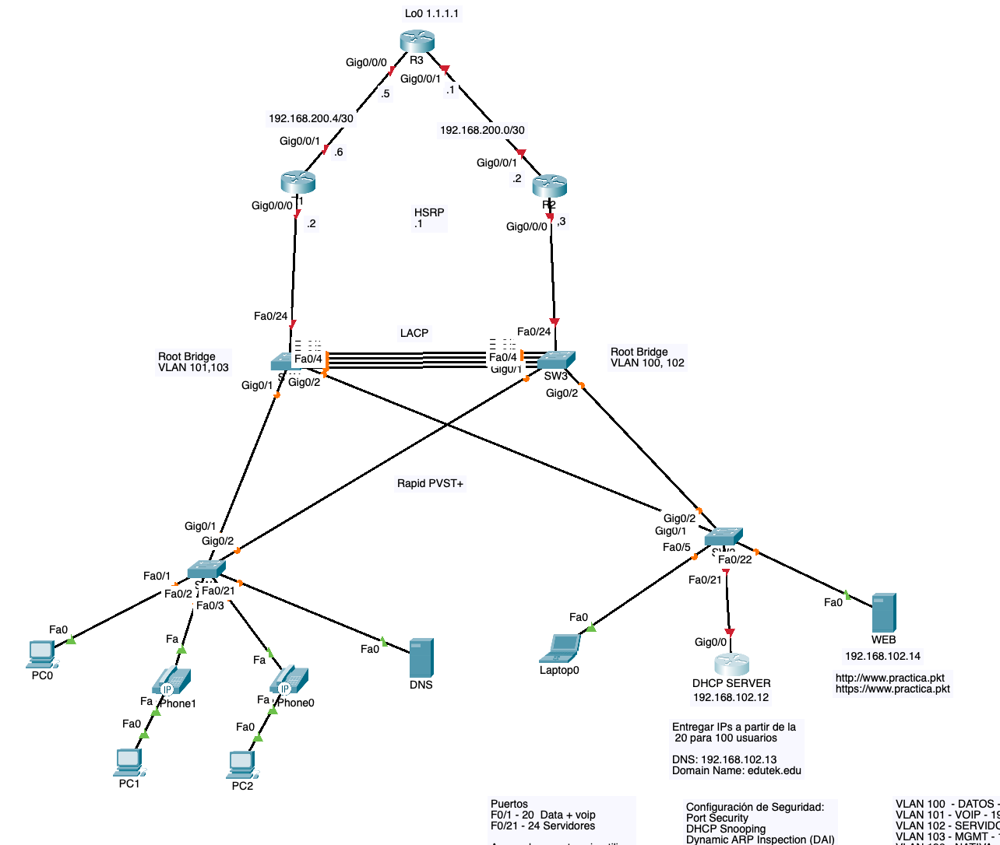

## Introducción

En entornos empresariales modernos, la segmentación de red mediante VLANs es fundamental para organizar el tráfico, mejorar la seguridad y optimizar el rendimiento. Sin embargo, la simple creación de VLANs no es suficiente: necesitamos permitir la comunicación entre ellas, garantizar alta disponibilidad de los servicios de gateway, automatizar la asignación de direcciones IP y proteger la infraestructura de capa 2 contra ataques comunes.

Este laboratorio integra cinco tecnologías esenciales que todo profesional de redes debe dominar: **Inter-VLAN Routing** para permitir comunicación entre segmentos de red aislados, **HSRP (Hot Standby Router Protocol)** para proporcionar redundancia de gateway, **DHCP** para automatizar la configuración de red de los hosts, **Spanning Tree Protocol** para prevenir loops en topologías redundantes, y medidas de **seguridad de capa 2** como Port Security y DHCP Snooping para proteger contra ataques de suplantación y flooding.

A través de una topología práctica que simula un entorno corporativo real, configuraremos paso a paso cada una de estas tecnologías, verificaremos su funcionamiento mediante pruebas exhaustivas, y analizaremos cómo trabajan conjuntamente para crear una red robusta, segura y altamente disponible.

## Temas Cubiertos:

- Intervlan Routing con Sub-interfaces
- Etherchannel
- Voice VLAN
- Spanning Tree (Portfast, BPDU Guard)
- HSRP
- DHCP Server
- Port Security
- DHCP Snooping
- ARP Dynamic Inspection

## Tabla de Contenidos

- [Topología De Red](#topología-de-red)
- [Laboratorio De Packet Tracer](#laboratorio-de-packet-tracer)
- [SW1 (Switch Acceso)](#sw1-switch-acceso)
  - [Configuración General](#configuración-general)
  - [Configuración De VLANS Y Puertos De Acceso](#configuración-de-vlans-y-puertos-de-acceso)
  - [Configuración De Puertos Troncales](#configuración-de-puertos-troncales)
  - [Configuración De Spanning Tree, Portfast Y BPDU Guard](#configuración-de-spanning-tree-portfast-y-bpdu-guard)
  - [Configuracion De Port Security](#configuracion-de-port-security)
  - [Configuracion De DHCP Snooping](#configuracion-de-dhcp-snooping)
  - [Configuracion De DAI (Dynamic ARP Inspection)](#configuracion-de-dai-dynamic-arp-inspection)
- [SW2 (Switch Acceso)](#sw2-switch-acceso)
  - [Configuración General](#configuración-general-1)
  - [Configuración De VLANs Y Puertos De Acceso](#configuración-de-vlans-y-puertos-de-acceso-1)
  - [Configuración De Puertos Troncales](#configuración-de-puertos-troncales-1)
  - [Configuración De Spanning Tree, Portfast Y BPDU Guard](#configuración-de-spanning-tree-portfast-y-bpdu-guard-1)
  - [Configuracion De Port Security](#configuracion-de-port-security-1)
  - [Configuracion De DHCP Snooping](#configuracion-de-dhcp-snooping-1)
  - [Configuracion De DAI (Dynamic ARP Inspection)](#configuracion-de-dai-dynamic-arp-inspection-1)
- [SW3 (Switch Distribucion)](#sw3-switch-distribucion)
  - [Configuración General](#configuración-general-2)
  - [Configuración De VLANs](#configuración-de-vlans)
  - [Enlaces Troncales](#enlaces-troncales)
  - [Configuración De Etherchannel (LACP)](#configuración-de-etherchannel-lacp)
  - [Configuración De Spanning Tree Y Root Bridges](#configuración-de-spanning-tree-y-root-bridges)
- [SW4 (Switch Distribucion)](#sw4-switch-distribucion)
  - [Configuración General](#configuración-general-3)
  - [Configuración De VLANs](#configuración-de-vlans-1)
  - [Enlaces Troncales](#enlaces-troncales-1)
  - [Configuración De Etherchannel (LACP)](#configuración-de-etherchannel-lacp-1)
  - [Configuración De Spanning Tree Y Root Bridge](#configuración-de-spanning-tree-y-root-bridge)
- [R1 (Router)](#r1-router)
  - [Configuración General](#configuración-general-4)
  - [Configuración De Sub-interfaces](#configuración-de-sub-interfaces)
  - [Enlace WAN Hacia R3](#enlace-wan-hacia-r3)
  - [Ruta Estática Por Defecto](#ruta-estática-por-defecto)
  - [Configuración De HSRP](#configuración-de-hsrp)
- [R2 (Router)](#r2-router)
  - [Configuración General](#configuración-general-5)
  - [Configuración De Interfaces](#configuración-de-interfaces)
  - [Configuración De HSRP](#configuración-de-hsrp-1)
  - [Enlace WAN Hacia R3](#enlace-wan-hacia-r3-1)
  - [Ruta Estática Por Defecto](#ruta-estática-por-defecto-1)
- [R3 (Router)](#r3-router)
  - [Configuración General](#configuración-general-6)
  - [Configuración De Interfaces](#configuración-de-interfaces-1)
  - [Rutas Estáticas Por Defecto](#rutas-estáticas-por-defecto)
- [Router (DHCP-SERVER)](#router-dhcp-server)
  - [Configuración De DHCP Server](#configuración-de-dhcp-server)
- [Conclusión](#conclusión)

## Topología De Red



## Laboratorio De Packet Tracer

[Este es el laboratorio con la configuración inicial](ccna-lab-12-sourcelab-init.pkt)

## SW1 (Switch Acceso)

### Configuración General

```bash
hostname SW1
enable secret cisco
line console 0
password cisco
login
exit
service password-encryption
ip domain-name edutek.edu
crypto key generate rsa
1024
ip ssh version 2
username admin secret cisco
username admin privilege 15
line vty 0 15
login local
transport input ssh
exit
no ip domain-lookup
````

### Configuración De VLANS Y Puertos De Acceso

```bash
vlan 100
name datos
vlan 101
name voip
vlan 102
name servidores
vlan 103
name mgmt
vlan 198
name nativa
vlan 199
name dummy
exit
````

```bash
interface range f0/1-20
description pc_telefono
switchport mode access
switchport access vlan 100
switchport voice vlan 101
exit
interface range f0/21-24
description servidores
switchport mode access
switchport access vlan 102
exit
```

#### Apagamos Los Puertos Sin Utilizar Y Los Metemos a Una Vlan Dummy

```bash
interface range f0/4-20,f0/22-24
shutdown
switchport access vlan 199
exit
```

### Configuración De Puertos Troncales

```bash
interface range G0/1-2
description troncal-ascendente
switchport mode trunk
switchport trunk native vlan 198
switchport trunk allowed vlan 100-103
switchport nonegotiate
exit
```

### Configuración De Spanning Tree, Portfast Y BPDU Guard

```bash
spanning-tree mode rapid-pvst
interface range f0/1-24
spanning-tree bpduguard enable 
spanning-tree portfast 
exit
```

### Configuracion De Port Security

#### Puertos Con PC Y Telefono

```bash
interface range f0/1-20
switchport port-security
switchport port-security maximum 3
switchport port-security mac-address sticky 
exit
```

#### Puertos Solo Con Un PC
```bash
interface range f0/21-24
switchport port-security
switchport port-security mac-address sticky 
exit
```

### Configuracion De DHCP Snooping

```bash
ip dhcp snooping 
ip dhcp snooping vlan 100-103

interface range g0/1-2
ip dhcp snooping trust
exit

interface range f0/1-24
ip dhcp snooping limit rate 50
exit
```

### Configuracion De DAI (Dynamic ARP Inspection)

```bash
ip arp inspection vlan 100-103
ip arp inspection validate src-mac dst-mac ip

interface range g0/1-2
ip arp inspection trust
exit
```

## SW2 (Switch Acceso)

### Configuración General

```bash
hostname SW2
enable secret cisco
line console 0
password cisco
login
exit
service password-encryption
ip domain-name edutek.edu
crypto key generate rsa
1024
ip ssh version 2
username admin secret cisco
username admin privilege 15
line vty 0 15
login local
transport input ssh
exit
no ip domain-lookup
```

### Configuración De VLANs Y Puertos De Acceso

```bash
vlan 100
name datos
vlan 101
name voip
vlan 102
name servidores
vlan 103
name mgmt
vlan 198
name nativa
vlan 199
name dummy
exit
```

```bash
interface range f0/1-20
description pc_telefono
switchport mode access
switchport access vlan 100
switchport voice vlan 101
exit
interface range f0/22-24
description servidores
switchport mode access
switchport access vlan 102
exit
```

### Apagamos Los Puertos Sin Utilizar Y Los Metemos a Una Vlan Dummy

```bash
interface range f0/1-4,f0/6-20,f0/23-24
shutdown
switchport access vlan 199
exit
```

## Configuración De Puertos Troncales

```bash
interface range G0/1-2
description troncal-ascendente
switchport mode trunk
switchport trunk native vlan 198
switchport trunk allowed vlan 100-103
switchport nonegotiate
exit
```

```bash
interface F0/21
description troncal-hacia-DHCP-Server
switchport mode trunk
switchport trunk native vlan 198
switchport trunk allowed vlan 100-103
switchport nonegotiate
exit
```

### Configuración De Spanning Tree, Portfast Y BPDU Guard

```bash
spanning-tree mode rapid-pvst
interface range f0/1-24
spanning-tree bpduguard enable 
spanning-tree portfast 
exit
```

### Configuracion De Port Security

```bash
interface range f0/1-20
switchport port-security
switchport port-security maximum 3
switchport port-security mac-address sticky 
exit

interface range f0/22-24
switchport port-security
switchport port-security mac-address sticky 
exit
```

### Configuracion De DHCP Snooping

```bash
ip dhcp snooping 
ip dhcp snooping vlan 100-103

interface range g0/1-2,f0/21
ip dhcp snooping trust
exit

interface range f0/1-24
ip dhcp snooping limit rate 50
exit
```

### Configuracion De DAI (Dynamic ARP Inspection)

```bash
ip arp inspection vlan 100-103
ip arp inspection validate src-mac dst-mac ip

interface range g0/1-2,f0/21
ip arp inspection trust
exit
```


## SW3 (Switch Distribucion)

### Configuración General

```bash
hostname SW3
enable secret cisco
line console 0
password cisco
login
exit
service password-encryption
ip domain-name edutek.edu
crypto key generate rsa
1024
ip ssh version 2
username admin secret cisco
username admin privilege 15
line vty 0 15
login local
transport input ssh
exit
no ip domain-lookup
````

### Configuración De VLANs

```bash
vlan 100
name datos
vlan 101
name voip
vlan 102
name servidores
vlan 103
name mgmt
vlan 198
name nativa
vlan 199
name dummy
exit
````
#### Apagamos Los Puertos Sin Utilizar Y Los Metemos a Una Vlan Dummy


```bash
interface range f0/5-23
switchport mode access
switchport access vlan 199
shutdown
exit
```

### Enlaces Troncales

```bash
interface range f0/1-4,g0/1-2,f0/24
description troncal
switchport mode trunk
switchport trunk native vlan 198
switchport trunk allowed vlan 100-103
switchport nonegotiate
exit
```

### Configuración De Etherchannel (LACP)

```bash
interface range f0/1-4
channel-group 1 mode active
exit

interface po1
switchport mode trunk
switchport trunk native vlan 198
switchport trunk allowed vlan 100-103
exit
```

### Configuración De Spanning Tree Y Root Bridges

```bash
spanning-tree mode rapid-pvst
spanning-tree vlan 100,102 root primary 
spanning-tree vlan 101,103 root secondary
```

## SW4 (Switch Distribucion)

### Configuración General

```bash
hostname SW4
enable secret cisco
line console 0
password cisco
login
exit
service password-encryption
ip domain-name edutek.edu
crypto key generate rsa
1024
ip ssh version 2
username admin secret cisco
username admin privilege 15
line vty 0 15
login local
transport input ssh
exit
no ip domain-lookup
````

## Configuración De VLANs

```bash
vlan 100
name datos
vlan 101
name voip
vlan 102
name servidores
vlan 103
name mgmt
vlan 198
name nativa
vlan 199
name dummy
exit
````

### Apagamos Los Puertos Sin Utilizar Y Los Metemos a Una Vlan Dummy

```bash
interface range f0/5-23
switchport mode access
switchport access vlan 199
shutdown
exit
````
## Enlaces Troncales

```bash
interface range f0/1-4,g0/1-2,f0/24
description troncal
switchport mode trunk
switchport trunk native vlan 198
switchport trunk allowed vlan 100-103
switchport nonegotiate
exit
````

## Configuración De Etherchannel (LACP)

```bash
interface range f0/1-4
channel-group 1 mode active
exit

interface po1
switchport mode trunk
switchport trunk native vlan 198
switchport trunk allowed vlan 100-103
exit
```

# Configuración De Spanning Tree Y Root Bridge

```bash
spanning-tree mode rapid-pvst
spanning-tree vlan 101,103 root primary
spanning-tree vlan 100,102 root secondary 
```

## R1 (Router)

### Configuración General

```bash
hostname R1
enable secret cisco
line console 0
password cisco
login
exit
service password-encryption
ip domain-name edutek.edu
crypto key generate rsa
1024
ip ssh version 2
username admin secret cisco
username admin privilege 15
line vty 0 15
login local
transport input ssh
exit
no ip domain-lookup
```

### Configuración De Sub-interfaces

```bash
interface g0/0/0.100
encapsulation dot1q 100
ip address 192.168.100.2 255.255.255.0
exit
interface g0/0/0.101
encapsulation dot1q 101
ip address 192.168.101.2 255.255.255.0
exit
interface g0/0/0.102
encapsulation dot1q 102
ip address 192.168.102.2 255.255.255.0
exit
interface g0/0/0.103
encapsulation dot1q 103
ip address 192.168.103.2 255.255.255.0
exit
interface g0/0/0
no shutdown
exit
```

### Enlace WAN Hacia R3

```bash
interface g0/0/1  
description to-R3 
ip address 192.168.200.6 255.255.255.252
no shutdown
```

### Ruta Estática Por Defecto

```bash
ip route 0.0.0.0 0.0.0.0 192.168.200.5
````

### Configuración De HSRP

```bash
interface g0/0/0.100
standby 100 ip 192.168.100.1
standby 100 priority 150
standby 100 preempt 
exit

interface g0/0/0.101
standby 101 ip 192.168.101.1
exit

interface g0/0/0.102
standby 102 ip 192.168.102.1
standby 102 priority 150
standby 102 preempt 
exit

interface g0/0/0.103
standby 103 ip 192.168.103.1
exit
```


## R2 (Router)

### Configuración General

```bash
hostname R2
enable secret cisco
line console 0
password cisco
login
exit
service password-encryption
ip domain-name edutek.edu
crypto key generate rsa
1024
ip ssh version 2
username admin secret cisco
username admin privilege 15
line vty 0 15
login local
transport input ssh
exit
no ip domain-lookup
```

### Configuración De Interfaces

```bash
interface g0/0/0.100
encapsulation dot1q 100
ip address 192.168.100.3 255.255.255.0
exit
interface g0/0/0.101
encapsulation dot1q 101
ip address 192.168.101.3 255.255.255.0
exit
interface g0/0/0.102
encapsulation dot1q 102
ip address 192.168.102.3 255.255.255.0
exit
interface g0/0/0.103
encapsulation dot1q 103
ip address 192.168.103.3 255.255.255.0
exit
interface g0/0/0
no shutdown
exit
```

## Configuración De HSRP

```bash
interface g0/0/0.100
standby 100 ip 192.168.100.1
exit

interface g0/0/0.101
standby 101 ip 192.168.101.1
standby 101 priority 150
standby 101 preempt 
exit

interface g0/0/0.102
standby 102 ip 192.168.102.1 
exit

interface g0/0/0.103
standby 103 ip 192.168.103.1 
standby 103 priority 150
standby 103 preempt 
exit
```

## Enlace WAN Hacia R3

```bash
interface g0/0/1  
description to-R3 
ip address 192.168.200.2 255.255.255.252
no shutdown
````

## Ruta Estática Por Defecto

```bash
ip route 0.0.0.0 0.0.0.0 192.168.200.1
```

## R3 (Router)

### Configuración General

```bash
hostname R3
enable secret cisco
line console 0
password cisco
login
exit
service password-encryption
ip domain-name edutek.edu
crypto key generate rsa
1024
ip ssh version 2
username admin secret cisco
username admin privilege 15
line vty 0 15
login local
transport input ssh
exit
no ip domain-lookup
````
### Configuración De Interfaces

```bash
interface g0/0/0
ip address 192.168.200.5 255.255.255.252
no shutdown

interface g0/0/1
ip address 192.168.200.1 255.255.255.252
no shutdown

interface lo0
ip address 1.1.1.1 255.255.255.255
````

### Rutas Estáticas Por Defecto

```bash
ip route 0.0.0.0 0.0.0.0 192.168.200.6
ip route 0.0.0.0 0.0.0.0 192.168.200.2
```
## Router (DHCP-SERVER)

```bash
interface g0/0.100
encapsulation dot1q 100
ip address 192.168.100.12 255.255.255.0
exit
interface g0/0.101
encapsulation dot1q 101
ip address 192.168.101.12 255.255.255.0
exit
interface g0/0.102
encapsulation dot1q 102
ip address 192.168.102.12 255.255.255.0
exit
interface g0/0.103
encapsulation dot1q 103
ip address 192.168.103.12 255.255.255.0
exit
interface g0/0
no shutdown
exit
````
### Configuración De DHCP Server

```bash
ip dhcp relay information trust-all

ip dhcp excluded-address 192.168.100.1 192.168.100.19
ip dhcp excluded-address 192.168.100.120 192.168.100.254

ip dhcp excluded-address 192.168.101.1 192.168.101.19
ip dhcp excluded-address 192.168.101.120 192.168.101.254

ip dhcp excluded-address 192.168.102.1 192.168.102.19
ip dhcp excluded-address 192.168.102.120 192.168.102.254

ip dhcp excluded-address 192.168.103.1 192.168.103.19
ip dhcp excluded-address 192.168.103.120 192.168.103.254

ip dhcp pool VLAN100
network 192.168.100.0 255.255.255.0
dns-server 192.168.102.13
default-router 192.168.100.1
domain-name edutek.edu
exit

ip dhcp pool VLAN101
network 192.168.101.0 255.255.255.0
dns-server 192.168.102.13
default-router 192.168.101.1
domain-name edutek.edu
exit

ip dhcp pool VLAN102
network 192.168.102.0 255.255.255.0
dns-server 192.168.102.13
default-router 192.168.102.1
domain-name edutek.edu
exit

ip dhcp pool VLAN103
network 192.168.103.0 255.255.255.0
dns-server 192.168.102.13
default-router 192.168.103.1
domain-name edutek.edu
exit
```

## Conclusión

Este laboratorio ha demostrado cómo múltiples tecnologías de red trabajan sinérgicamente para crear una infraestructura empresarial completa y resiliente. A través de la configuración práctica, hemos visto cómo:

- **Inter-VLAN Routing** permite que diferentes segmentos de red se comuniquen mientras mantienen su aislamiento lógico
- **HSRP** proporciona redundancia automática del gateway, eliminando puntos únicos de fallo en la infraestructura
- **DHCP** simplifica dramáticamente la administración de direcciones IP en entornos de múltiples VLANs
- **Spanning Tree Protocol** previene loops de capa 2 mientras optimiza las rutas de forwarding mediante prioridades configurables
- **Las medidas de seguridad L2** protegen contra amenazas comunes como MAC flooding, DHCP spoofing y ataques Man-in-the-Middle

La integración exitosa de estas cinco tecnologías no solo requiere conocimiento técnico de cada protocolo individualmente, sino también comprensión de cómo interactúan entre sí. Por ejemplo, DHCP Snooping depende de la configuración correcta de VLANs y puertos trunk, mientras que HSRP debe coordinarse con la topología de Spanning Tree para evitar asimetrías de routing.

Este tipo de configuración multi-tecnológica es representativa de redes empresariales reales, donde la redundancia, automatización y seguridad son requisitos no negociables. El dominio de estos conceptos y su implementación práctica constituye una base sólida para cualquier profesional que busque especializarse en diseño, implementación y troubleshooting de redes corporativas.

---

Espero que este laboratorio te haya proporcionado una experiencia práctica valiosa en la integración de tecnologías fundamentales de networking. Ya sea que estés preparándote para la certificación CCNA, profundizando tus conocimientos en redes empresariales, o buscando aplicar estos conceptos en proyectos reales, dominar la interacción entre Inter-VLAN Routing, HSRP, DHCP, STP y seguridad L2 te dará una ventaja significativa.**

Recuerda que la verdadera maestría viene de la práctica iterativa: te animo a experimentar con variaciones de esta topología, provocar fallos intencionalmente para observar cómo responden los protocolos de redundancia, y ajustar las configuraciones de seguridad para entender sus límites. El laboratorio de redes es tu espacio seguro para romper cosas, aprender de los errores, y construir la confianza que necesitarás cuando trabajes con infraestructura de producción.**

**¡Éxito en tu camino hacia la certificación CCNA y en tu desarrollo profesional en el fascinante mundo de las redes!**